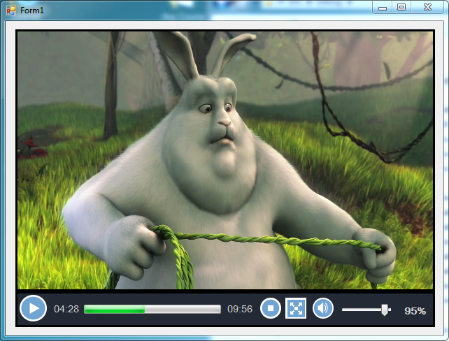

# LibvlcSharp Media Element For Winforms

Libvlcsharp is wrapper around libvlc(VLC libray).  
It is use to play media.   
But we would have to add video control ourself for most platforms.   
By using MediaPlayerelemnt, you will NOT have to do this headche.   
This MediaPlayerElement is only for winforms.  
<b>Note : </b> Well it works fine But even I may have done many mistakes. So pardon me.

  

<b>What controls added ?</b>
<ol>
<li>Play/Pause Button</li>
<li>Current Time and Total Duration Labels like 00:00</li>
<li>VideoSeekbar</li>
<li>Stop Button</li>
<li>Full/Normal screen button</li>
<li>Volume Button for mute/unmute</li>
<li>Volumebar</li>
<li>Play/Pause on VideoView Click</li>
<li>Full/Normal screen on VideoView Double Click</li>
<li>Autohide Controls in full screen after 3 seconds of inactivity And also reappear on key+mouse activity</li>
<li>Others as well (I am idiot I forget)</li>
</ol>
